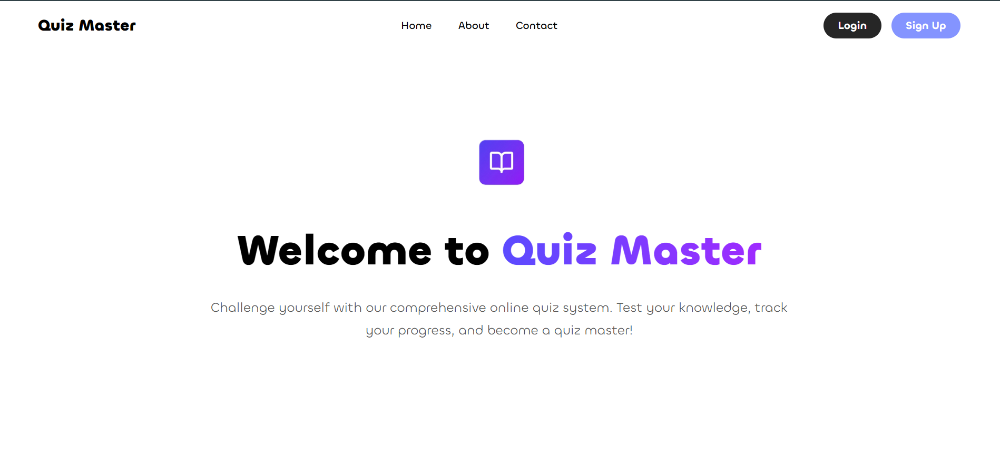

# 🧠 Dynamic Full-Stack Quiz Application

A robust, data-driven web application built to demonstrate full-stack development capabilities. This project features a secure dynamic architecture where quiz questions, choices, and user scores are stored and managed through a MySQL database.

## 📸 Screenshots

### Dashboard / Quiz Interface


## 🛠️ Full-Stack Skills Demonstrated

### 🗄️ Backend & Database (PHP & MySQL)
* **Relational Database Design:** Structured MySQL tables for users, questions, options, and correct answers.
* **Dynamic Content Delivery:** Fetching random or category-specific quiz data dynamically using PHP.
* **CRUD Operations:** Inserting user scores and tracking quiz progression directly in the database.
* **Security Practices:** Utilizing prepared statements to protect the application against SQL injection attacks.

### 🎨 Frontend & Interactivity (HTML5, CSS3, JavaScript)
* **Asynchronous Logic (JS):** Handling timer mechanics, instant score calculations, and UI state changes without forcing page reloads.
* **Responsive UI/UX:** Styled using modern CSS (Flexbox/Grid) to ensure the quiz is completely playable on mobile, tablet, and desktop devices.
* **Semantic Structure:** Accessible HTML forms for smooth user inputs and interactive quiz navigation.

## 🚀 How to Run the Project Locally

To set up this full-stack project on your local machine, follow these steps:

1. **Prerequisites:** Install a local server environment like **XAMPP**, **WAMP**, or **MAMP**.
2. **Clone the Repository:** Clone this folder into your server's root directory (e.g., `htdocs` for XAMPP).
   ```bash
   git clone https://github.com
   ```
3. **Database Setup:**
   * Open `phpMyAdmin` in your browser.
   * Create a new database (e.g., `quiz_db`).
   * Import the provided `.sql` file located in this repository.
4. **Configuration:** Update your database connection credentials (host, username, password, database name) in your PHP configuration file (e.g., `db.php` or `config.php`).
5. **Run:** Start your Apache and MySQL servers, then navigate to `http://localhost/YOUR_REPO_NAME` in your web browser.
